<h1>Improved Packet Encapsulation Visualization</h1>

https://harryli0088.github.io/improved-packet-encapsulation-visualization/



I made (in my opinion) improved packet encapsulation visualizations.
The main ideas to communicate are preserved, namely that each subsequent layer encapsulates and abstracts the data from the previous layer.
At the same time, the dotted lines and curly braces make it more evident that the upper layers are not duplicated and also sent along,
but rather are a way of visually breaking down the encapsulations.

Google Slides Version: https://docs.google.com/presentation/d/1zAoo-gQp8Dvv8wP9MSVR4KtrOzsT9i6xAuVzN9musTs/edit?usp=sharing

## Deploying to Github Pages

Adapted from https://github.com/Sh031224/svelte-kit-github-page-example

1. Install ```adapter-static``` and ```gh-pages```
```
npm i -D @sveltejs/adapter-static@next gh-pages
```

2. Updated ```svelte.config.js```
```js
import static_adapter from '@sveltejs/adapter-static';

const config = {
  kit: {
    adapter: static_adapter({
      // default options are shown
      pages: 'build',
      assets: 'build',
      fallback: null
    }),
    paths: {
      base: process.env.NODE_ENV==="production" ? '/your-repo-name' : undefined,
    }
  }
};

export default config;
```

3. Add an empty ```.nojekyll``` file in your ```static/``` directory, otherwise GitHub Pages will ignore files with a leading underscore (ie ```_app/```)

4. Add a deploy script to ```package.json```
```json
{
  "scripts": {
    "deploy": "npm run build && npx gh-pages -d build -t true"
  }
}
```

5. Run the deploy script
```
npm run deploy
```
